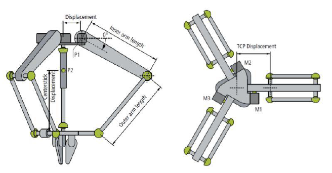
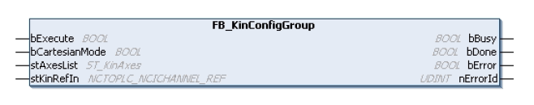
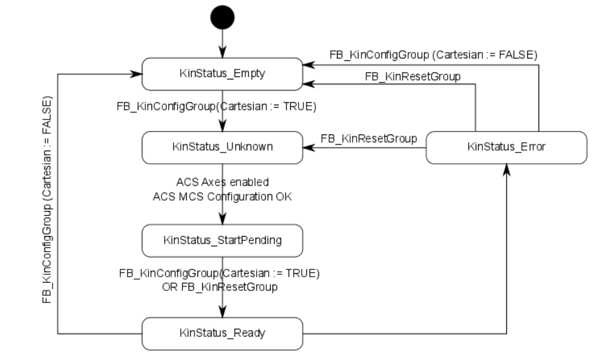

# Delta Robot Kinematic with TwinCAT & 3D Simulation in OpenGL C#

## Summary

- In this study, the materials coming from the conveyor line will be taken from the conveyor line by using a delta robot arm and placed in the desired position as required by the process.

- A software was implemented to perform the 3D simulation of this system. Thus, the real-time movements of the system are followed by the user through this simulation program.


### Usage
- **"OpenGL_Deneme.rar"** in this file you can find C# Codes for the simulation also you can find TwinCAT codes in **"TC3_deltarobotprojects.rar"** file.


 
## Kinematic Analysis Calculation with TwinCAT


The kinematic calculations of the delta robot arm to be simulated in the project will be calculated with the function blocks in the TwinCAT3 program.

Thus, the X, Y, Z coordinates that the delta robot arm will move during the operation of the conveyor system developed in the TwinCAT3 program will be obtained as a result of the mathematical operation that is solved within these blocks.

In order to calculate kinematics with TwinCAT, it is necessary to specify the type of system to be used.

The delta robot arm to be used is seen as **"Delta Type 1"** when the documents prepared by Beckhoff company about kinematic motion are examined. 
(You can reach the kinematic transformations booklet prepared by Beckhoff company <a href="https://download.beckhoff.com/download/document/automation/twincat3/TF5110-TF5113_TC3_Kinematic_Transformation_EN.pdf" target="_blank">**here**</a>.)



When the values specified in the figure above (Inner arm length, Outer arm length, etc.) are adapted to the TwinCAT, the system will be ready for kinematic calculations.

The function block **FB_KinConfigGroup** configures axes according to the kinematic transformation. These are axes for the **ACS (joint)** and the **MCS (Cartesian)**. The function block takes the **ACS** and **MCS** axes defined in the stAxesList and configures them in the kinematic group of stKinRefIn.



### Example

```ruby
VAR
    io_X                  : AXIS_REF;
    io_Y                  : AXIS_REF;
    io_Z                  : AXIS_REF;
    io_M1                 : AXIS_REF;
    io_M2                 : AXIS_REF;
    io_M3                 : AXIS_REF;
    in_stKinToPlc AT %I*  : NCTOPLC_NCICHANNEL_REF;
    fbConfigKinGroup      : FB_KinConfigGroup;
    stAxesConfig          : ST_KinAxes;
    bAllAxesReady         : BOOL;
    bExecuteConfigKinGroup: BOOL;
    bUserConfigKinGroup   : BOOL;
    bUserCartesianMode    : BOOL := TRUE;
    (*true: cartesian mode - false: direct mode (without transformation) *)
END_VAR
```

```ruby

(* read the IDs from the cyclic axis interface so the axes can mapped later to the kinematic group
*)
stAxesConfig.nAxisIdsAcs[1] := io_M1.NcToPlc.AxisId;
stAxesConfig.nAxisIdsAcs[2] := io_M2.NcToPlc.AxisId;
stAxesConfig.nAxisIdsAcs[3] := io_M3.NcToPlc.AxisId;
stAxesConfig.nAxisIdsMcs[1] := io_X.NcToPlc.AxisId;
stAxesConfig.nAxisIdsMcs[2] := io_Y.NcToPlc.AxisId;
stAxesConfig.nAxisIdsMcs[3] := io_Z.NcToPlc.AxisId;
IF bAllAxesReady AND bUserConfigKinGroup THEN
    bExecuteConfigKinGroup := TRUE;
ELSE
    bExecuteConfigKinGroup := FALSE;
END_IF
fbConfigKinGroup(
    bExecute       := bExecuteConfigKinGroup ,
    bCartesianMode := bUserCartesianMode ,
    stAxesList     := stAxesConfig,
    stKinRefIn     := in_stKinToPlc );

```

## State of Kinematic Group


### Enable configuration 
The ACS axes must be enabled through MC_Power, to ensure that the state can reach the value KinStatus_Ready. If the ACS axes are not enabled, enable the axes and then call up FB_KinConfigGroup or FB_KinResetGroup.


## Video

[](https://youtu.be/0gQZ20m5Olw)
